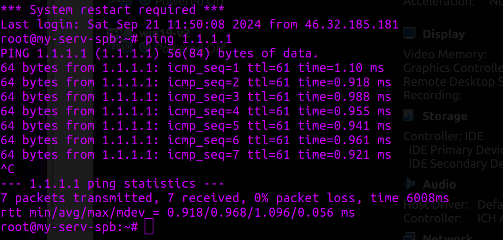

University: [ITMO University](https://itmo.ru/ru/)  
Faculty: [FICT](https://fict.itmo.ru)  
Course: [Network programming](https://github.com/itmo-ict-faculty/network-programming)  
Year: 2024/2025  
Group: K34202  
Author: Gleb Demin  
Lab: Lab1  
Date of create: 13.12.2024  
Date of finished: 13.12.2024  

## Лабораторная работа №1 "Установка CHR и Ansible, настройка VPN"
### Оглавление
- [Описание](#section1)
- [Цель работы](#section2)
- [Ход работы](#section4)
  - [Selectl VDS](#section4.1)
  - [VirtualBox и CHR (RouterOS)](#section4.2)
  - [Создание интерфейса Wireguard на RouterOS](#section4.3)
  - [Создание интерфейса Wireguard на Selectl VDS](#section4.4)
  - [Тесты](#section4.5)
- [Вывод](#section4.6)

## <a name="section1">Описание</a>
Данная работа предусматривает обучение развертыванию виртуальных машин (VM) и системы контроля конфигураций Ansible а также организации собственных VPN серверов.

## <a name="section2">Цель работы</a>
Целью данной работы является развертывание виртуальной машины на базе платформы Microsoft Azure с установленной системой контроля конфигураций Ansible и установка CHR в VirtualBox.

## <a name="section4">Ход работы</a>    

### <a name="section4.1">Selectl VDS</a> 
Для удобства было принято решение воспользоваться сервисом Selectl VDS. После приобретения и установки сервера, было воспроизведено подключение к нему по ssh
<p align="center"></p>

<p align="center"></p>

А также установлены необходимые компоненты: python, ansible
<p align="center"></p>

### <a name="section4.2">VirtualBox и CHR (RouterOS)</a> 
CHR (Cloud Hosted Router) от MikroTik — это виртуальная версия маршрутизатора RouterOS, предназначенная для использования в виртуализированных средах.

<p align="center"></p>

Переключим режим работы сети на Bridge, чтобы напрямую подключаться к физической сети, используя тот же сетевой интерфейс, что и основной хост.

<p align="center"></p>

Теперь можно подключиться к ВМ с помощью VinBox

<p align="center"></p>

### <a name="section4.3">Создание интерфейса Wireguard на RouterOS (клиент)</a> 

В старших версиях RouterOS уже есть встроенный Wireguard интерфейс, поэтому включаем его и настраиваем (ключи автоматически генерируются).

<p align="center"></p>

<p align="center"></p>

Кроме самого интерфейса важно указать peer с endpoint ip, портом нашего сервера и публичным ключом, который будет сгенерирован на сервере

<p align="center"></p>

На стороне клиента параметр AllowedIPs указывает, какие IP-адреса будут отправляться через туннель WireGuard. Это фактически определяет маршруты, по которым трафик клиента будет передаваться через туннель.

### <a name="section4.4">Создание интерфейса Wireguard на Selectl VDS (сервер)</a> 

На самом сервере создаем пару ключей

```bash
/etc/wireguard/
wg genkey > privatekey
wg pubkey < privatekey > publickey
```
А также создадим конфигурационный файл, с интерфейсом, в котором укажем приватный ключ сервера, IP из той же подсети и peer, в котором будет публичный ключ клиента и его ip 

```bash
root@my-serv-spb:~# cat /etc/wireguard/wg0.conf 
[Interface]

PrivateKey = EDY9niad14YAoKrj8Dr6LexrcglpsHDubtmm5Gy+/GQ=
Address = 10.0.0.1/24
ListenPort = 51820

[Peer]

PublicKey = yQr5zsil3vtV0T+Yh+eUpX0Jli8OlJY9RXellkCDlSE=
AllowedIPs = 10.0.0.2/32
```
На стороне сервера AllowedIPs указывает, какие IP-адреса могут быть связаны с конкретным клиентом (пиром).

<p align="center"></p>

### <a name="section4.5">Тесты</a> 

* Сервер -> Клиент

<p align="center"></p>

* Проверка интернет соединения

<p align="center"></p>


* Клиент -> Сервер

<p align="center"></p>

* Проверка интернет соединения

<p align="center"></p>


## <a name="section4.6">Вывод</a> 

В ходе выполнения данной лабораторной работы был поднят сервер на платформе Selectl VDS, на нем установлены система контроля конфигураций Ansible и python, также была поднята ВМ с CHR в VirtualBox. В данных устройствах был поднят Wireguard интерфейс и настроен тоннель между ними.


