University: [ITMO University](https://itmo.ru/ru/)  
Faculty: [FICT](https://fict.itmo.ru)  
Course: [Network programming](https://github.com/itmo-ict-faculty/network-programming)  
Year: 2024/2025  
Group: K34202  
Author: Gleb Demin  
Lab: Lab2  
Date of create: 13.12.2024  
Date of finished: 13.12.2024  

## Лабораторная работа №2 "Развертывание дополнительного CHR, первый сценарий Ansible"

###  <a name="section0">Оглавление</a>
- [Оглавление](№section0)
- [Описание](#section1)
- [Цель работы](#section2)
- [Ход работы](#section3)
  - [Подготовка второго CHR устройств](#section3.1)
  - [Работа с Ansible](#section3.2)
  - [Выполнение playbook.yaml](#section3.4)
  - [Результат](#section3.3)
- [Вывод](#section4)

## <a name="section1">Описание</a>
В данной лабораторной работе вы на практике ознакомитесь с системой управления конфигурацией Ansible, использующаяся для автоматизации настройки и развертывания программного обеспечения.  
## <a name="section2">Цель работы</a>
С помощью Ansible настроить несколько сетевых устройств и собрать информацию о них. Правильно собрать файл Inventory.
## <a name="section3">Ход работы</a> 

### <a name="section3.1">Подготовка второго CHR устройств</a> 
Соответственно первой лабораторной работе поднимим вторую ВМ с Microtik, подключимся к ней по Winbox и настроим Wireguard

<p align="center">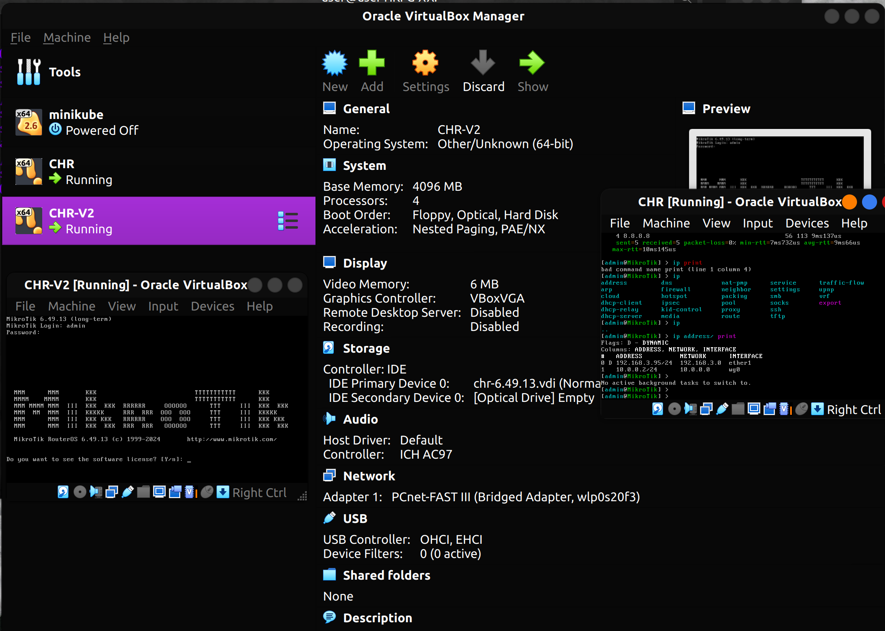</p>

Настроим новый интерфейс адаптера CHR-V2 для связи с сервером, обновим файл конфигурации на самом сервере

<p align="center">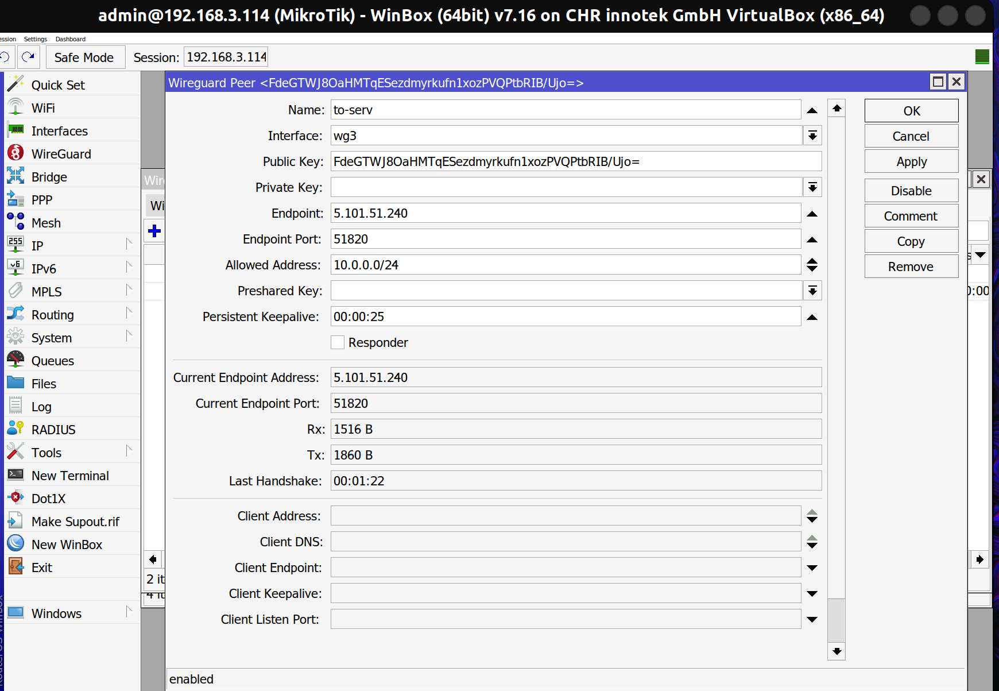</p>

<p align="center">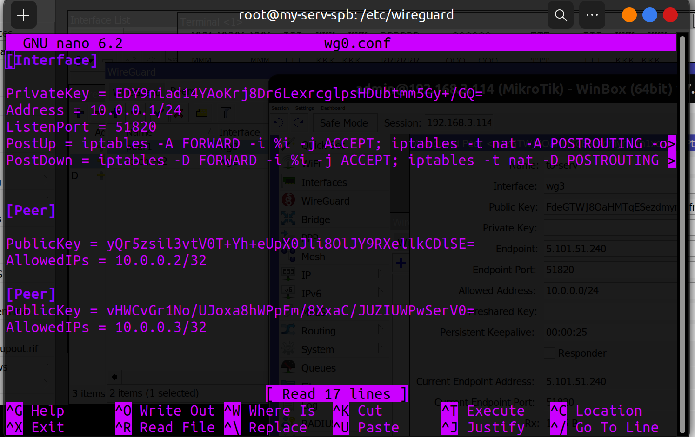</p>

Настроим новый интерфейс адаптера для подключения двух ВМ CHR по Wireguard

Проверим связь CHR-V2 - Serv

* CHR-V1 (192.168.3.95)

<p align="center">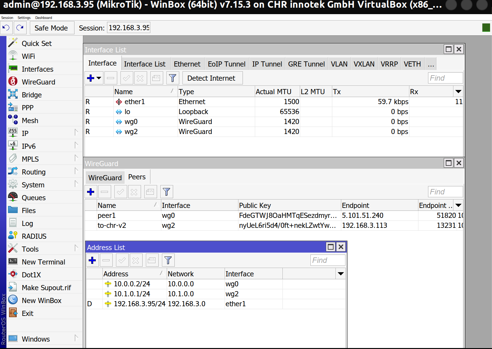</p>

* CHR-V2 (192.168.3.113)

<p align="center">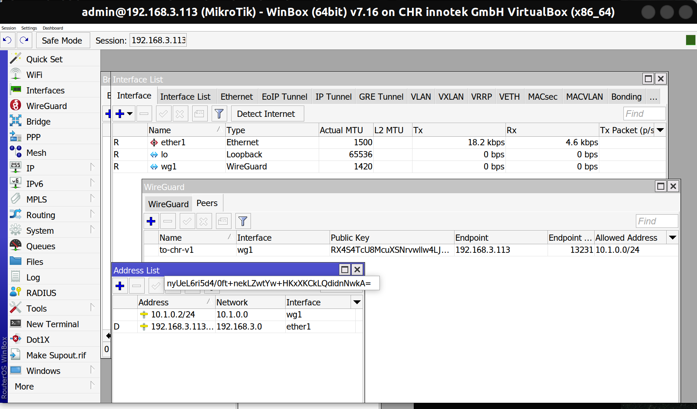</p>

Сразу проверяем связь

* CHR-V1 -> CHR-V2

<p align="center">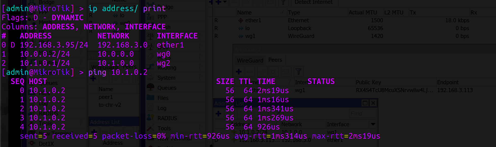</p>

* CHR-V2 -> CHR-V1

<p align="center">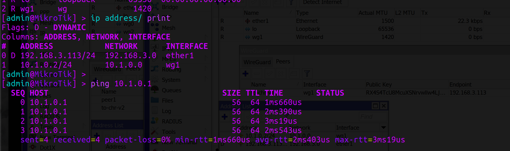</p>

Можно явно заметить, что все устройства находятся в одной локальной сети, можно разрешить работу с различными подсетями, настроив маршрутизацию между подсетями.

```bash
iptables -A FORWARD -s 10.0.0.0/24 -d 10.2.0.0/24 -j ACCEPT
iptables -A FORWARD -s 10.2.0.0/24 -d 10.0.0.0/24 -j ACCEPT
```
### <a name="section3.2">Работа с Ansible</a>

Ansible по умолчанию использует SSH для подключения к удалённым хостам, и WireGuard в данном случае выполняет роль защищённого канала, через который осуществляется SSH-подключение.

Поэтому настроим ключи, чтобы не возникало проблем с паролями

<p align="center">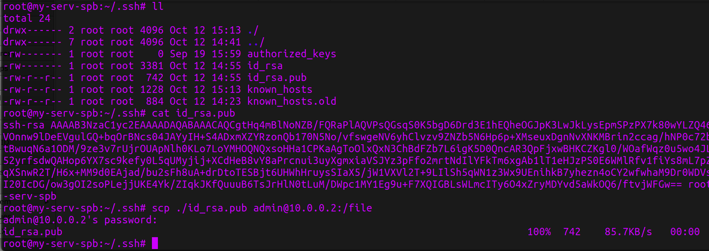</p>

*Имя файла и расширение задано вручную, так как не удалось это сделать с помощью scp

Импортируем публичный ключ сервера и проверяем, что теперь пароль не обязателен

<p align="center">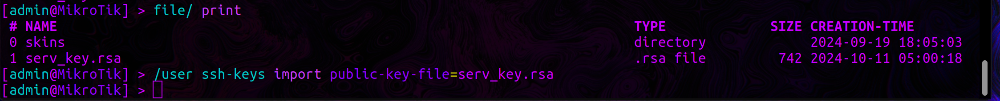</p>

<p align="center">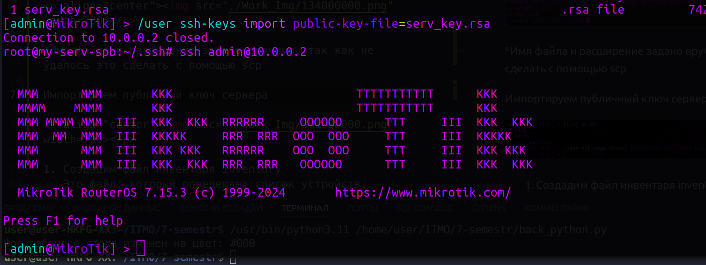</p>

(Аналогично для CHR-V2)

1. Создадим файл hosts в дириктории inventory (в последствии будет обновлен)

Это файл, который определяет список устройств.

<p align="center">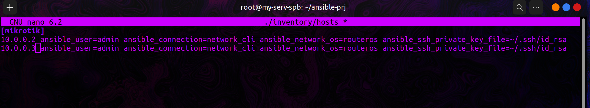</p>

* ansible_connection=network_cli указывает, что подключение подходит для сетевых устройств, таких как маршрутизаторы и коммутаторы.

* ansible_network_os=routeros определяет операционную систему устройства как RouterOS

* ansible_ssh_private_key_file=~/.ssh/id_rsa указывает путь к приватному ключу SSH, который используется для аутентификации на MikroTik

2. Также создадим конфигурационный файл ansible.cfg

<p align="center">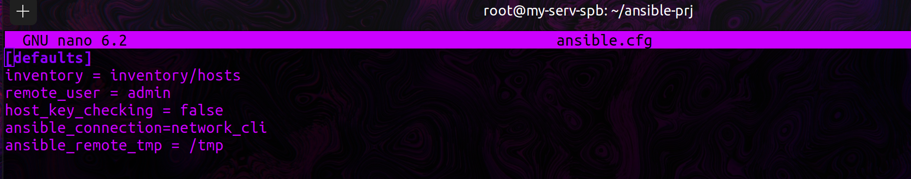</p>

Настройки в ansible.cfg применяются ко всем хостам, если они не переопределены в файле hosts. В файле hosts можно указать конкретные параметры для отдельных хостов, чтобы иметь больше контроля над подключениями

Теперь можно проверь связь с помощью команды 

```bash
ansible -i ./inventory/hosts mikrotik -m ping
```

<p align="center"></p>

3. Создадим playbook

Это основной файл, где описаны задачи.  

Как минимум, каждый play определяет две вещи:
- управляемые узлы для нацеливания 
- используя шаблон по крайней мере одна задача для выполнения

В данном случае нам необходимо использовать коллекцию community.routeros, она идеально подходит к нашему заданию

Исходя из рекомендаций https://github.com/ansible-collections/community.routeros

Немного правим наш файл hosts на итоговый рабочий вариант

<p align="center">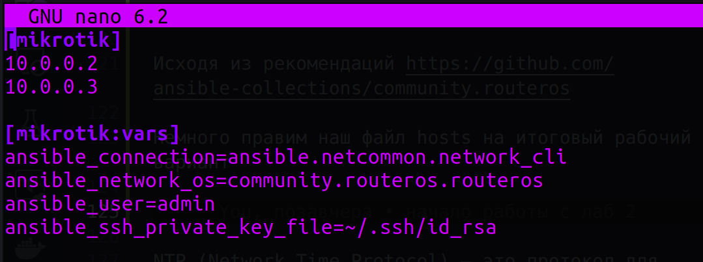</p>

Также нам понадобится предварительно установить ansible-pylibssh (библиотека для Ansible, которая предоставляет интерфейс для работы с SSH-соединениями, используя библиотеку libssh)
**Или** же Paramiko, другую популярную библиотеку для работы с SSH в Ansible.

```bash
pip install ansible-pylibssh
```

<details>
<summary><b>Тестовый сценарий модуля community.routeros</b></summary>

```yaml
---
- name: RouterOS test with network_cli connection
  hosts: mikrotik
  gather_facts: false
  tasks:
    - name: Run a command
      community.routeros.command:
        commands:
          - /system resource print
      register: system_resource_print
    - name: Print its output
      ansible.builtin.debug:
        var: system_resource_print.stdout_lines

    - name: Retrieve facts
      community.routeros.facts:
    - ansible.builtin.debug:
        msg: "First IP address: {{ ansible_net_all_ipv4_addresses[0] }}"
```
</details>
Он был выполнен удачно:
* Выведена информация о системных ресурсах обоих RouterOS;
* Собраны факты об устройстве, такие как версия RouterOS, IP-адреса и другие параметры.

<p align="center">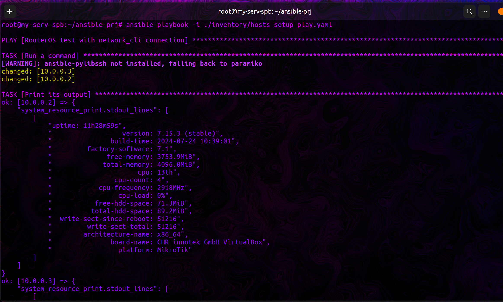</p>

Теперь обновим этот шаблон под наши задачи: сменим пароль (логин менять не стал, тк не удобно), добавим NTP Client 

NTP (Network Time Protocol) — это протокол для синхронизации времени на компьютерах и сетевых устройствах. Он позволяет устройствам в сети поддерживать точное время, получая его от специализированных NTP-серверов.

```yaml
---
- name: Setup MikroTik CHR
  hosts: mikrotik
  gather_facts: no
  tasks:
    # Настройка логина и пароля
    - name: Set admin login credentials
      community.routeros.command:
        commands:
          - /user set admin password="QWERTY"
      register: user_verify
      ignore_errors: no

    - name: Verify Сhanges
      ansible.builtin.debug:
        msg: "Ну есть жеееее, работает"

    - name: Show user change result
      ansible.builtin.debug:
        msg: |
          "Порядки меняются, пароль запривачен {{ inventory_hostname }}:{{ user_verify }}"

    # Настройка NTP-клиента
    - name: Configure NTP Client
      community.routeros.command:
        commands:
          - /system ntp client set enabled=yes mode=unicast
          - /system ntp client servers add address=216.239.35.4
          - /system ntp client servers add address=216.239.35.8  # google NTP servers
          - /system ntp client print
      register: ntp_result
      ignore_errors: no
```

<p align="center">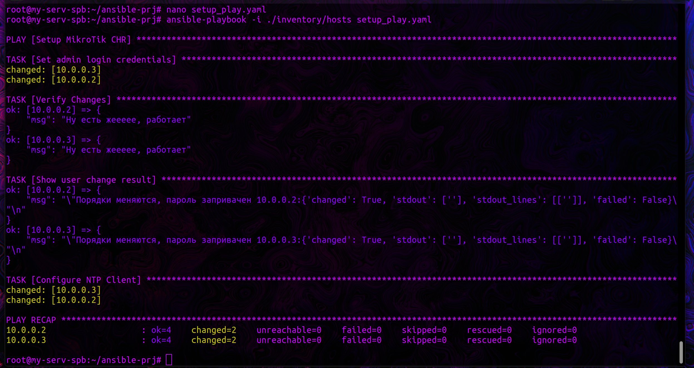</p>

<p align="center">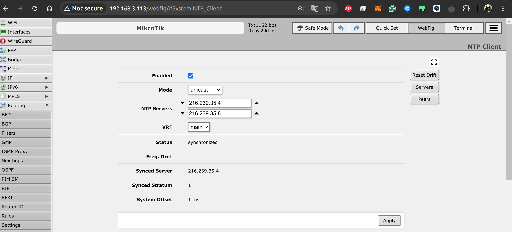</p>

Далее обновим сценарий, добавим OSPF с указанием Router ID и соберем данные по OSPF топологии и полный конфиг устройств.

OSPF — это протокол внутреннего шлюза (IGP), предназначенный для распространения информации о маршрутизации между маршрутизаторами, принадлежащими одной автономной системе (AS).

В MikroTik RouterOS используется для добавления сетевого интерфейса в определенную зону OSPF area=backbone: Указывает, что сетевой интерфейс должен быть добавлен в OSPF-зону, которая называется "backbone" (главная зона OSPF с идентификатором 0.0.0.0). 
Зона OSPF (Area) - это логическая группа устройств OSPF внутри автономной системы (AS). OSPF разделяет сеть на зоны, и каждый маршрутизатор в зоне знает о всех маршрутах внутри этой зоны.


**!Чтобы настройки OSPF работали, необходимо обновить конфигурацию сетевых интерфейсов wireguard, добавив в Allowed Adresses мультикаст адрес 224.0.0.5/32, а также адрес Router-Id loopback интерфейса!**

<p align="center">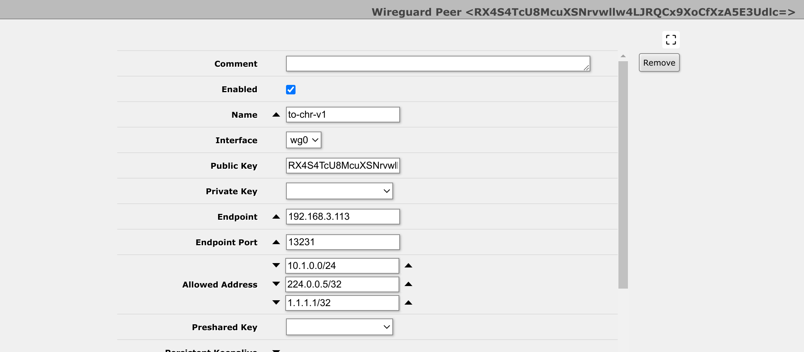</p>

```yaml
  - name: Configure OSPF with specific Router ID for each CHR
    community.routeros.command:
      commands:
        - /ip address add address={{ router_id }} interface=lo
        - /routing ospf instance add disabled=no name=skynet router-id={{ router_id }} redistribute=connected,static
        - /routing ospf area add disabled=no instance=skynet name=backbone
        - /routing ospf interface-template add area=backbone cost=100 disabled=no type=ptp interfaces={{ router_int }}
    vars:
      router_id: "{{ '1.1.1.1' if ansible_host == '10.0.0.2' else '3.3.3.3' }}"
      router_int: "{{ 'wg2' if ansible_host == '10.0.0.2' else 'wg0' }}"

- name: OSPF topology data
  community.routeros.command:
    commands:
      - /routing/ospf/neighbor/print
      - /routing/ospf/interface/print
      - /routing/ospf/area/print
      - /routing/ospf/instance/print
  register: ospf_data

  - name: Get full device configuration
    community.routeros.command:
      commands:
        - /export
    register: full_config

  - name: Print OSPF data
    ansible.builtin.debug:
      var: ospf_data

  - name: Print full device configuration
    ansible.builtin.debug:
      var: full_config

```


Данные об OSPF и конфигу устройства на ходятся в переменных ospf_data и full_config

### <a name="section3.4">Выполнение</a>

<p align="center">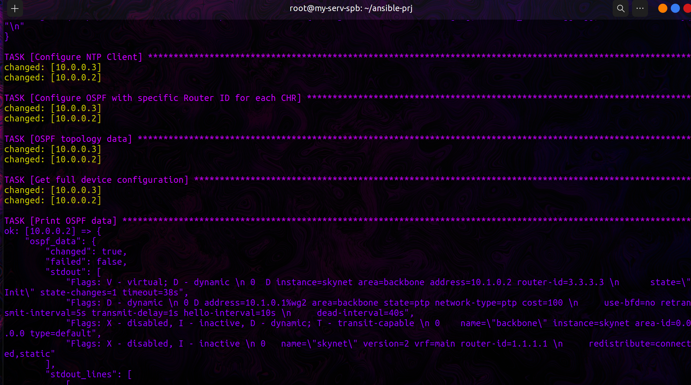</p>

<p align="center"></p>

### <a name="section3.3">Результат (настроенный ospf между CHR)</a>

* CHR-V1
<p align="center"></p>

* CHR-V2
<p align="center"></p>

<p align="center"></p>

<p align="center"></p>

<p align="center"></p>


## <a name="section4">Вывод</a> 

В ходе выполнения данной лабораторной работы был настроен OSPF через WireGuard на MikroTik, NTP Client и авторизация с помощью Ansible 