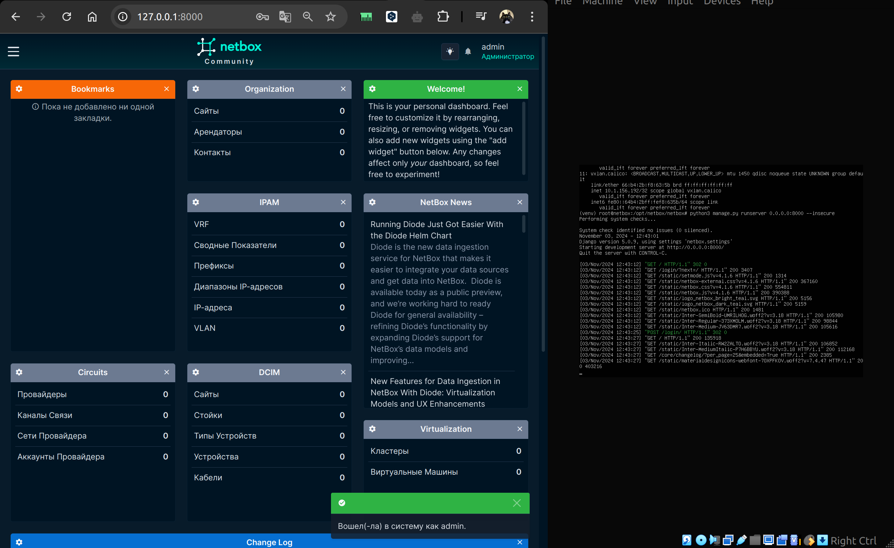

University: [ITMO University](https://itmo.ru/ru/)  
Faculty: [FICT](https://fict.itmo.ru)  
Course: [Network programming](https://github.com/itmo-ict-faculty/network-programming)  
Year: 2024/2025  
Group: K34202  
Author: Gleb Demin  
Lab: Lab3  
Date of create: 13.12.2024  
Date of finished: 13.12.2024  

## Лабораторная работа №3 "Развертывание Netbox, сеть связи как источник правды в системе технического учета Netbox"

###  <a name="section0">Оглавление</a>
- [Оглавление](№section0)
- [Описание](#section1)
- [Цель работы](#section2)
- [Ход работы](#section3)
  - [Установка NetBox](#section3.1)
  - [Работа с NetBox](#section3.2)
  - [Ansible + NetBox](#section3.4)
- [Вывод](#section4)

## <a name="section1">Описание</a>
В данной лабораторной работе вы ознакомитесь с интеграцией Ansible и Netbox и изучите методы сбора информации с помощью данной интеграции.

## <a name="section2">Цель работы</a>
С помощью Ansible и Netbox собрать всю возможную информацию об устройствах и сохранить их в отдельном файле.

## <a name="section3">Ход работы</a> 

### <a name="section3.1">Установка NetBox</a> 

Документация установки netbox  
https://netboxlabs.com/docs/netbox/en/stable/installation/

Документация Ansible+Netbox  
https://netboxlabs.com/blog/getting-started-with-network-automation-netbox-ansible/

Netbox — это открытое веб приложение, разработанное для управления и документирования компьютерных сетей.

Охватывает аспекты:

* IP address management (IPAM) — IP сети и адреса, VRFs, и VLAN
* DataCenter infrastructure management (DCIM) — организация стоечного оборудования по группам и устройствам
* Устройства — типы устройств и место установки
* Соединения — сеть, консоль, силовые соединения
* Виртуализация — виртуальные машины и кластеры
* Схемы передачи данных — схемы дальней связи и провайдеры
* Секреты — зашифрованное хранение конфиденциальных учетных данных

Запускаем netbox с официального github на новой vm

<p align="center"></p>

Устанавливаем postgresql, создаем БД, пользователя и устанавливаем привилегии

<p align="center"></p>

Redis — это хранилище ключей и значений в памяти, используемое NetBox для кэширования и постановки в очередь фоновых задач. Redis обычно требует минимальной настройки; приведенных в ~/netbox/configuration_example.py будет достаточно

<p align="center"></p>

```bash
sudo apt install -y python3 python3-pip python3-venv python3-dev build-essential libxml2-dev libxslt1-dev libffi-dev libpq-dev libssl-dev zlib1g-dev
```

Далее с гита клонируем репозиторий netbox

<p align="center"></p>

<p align="center"></p>

После настройки configurate.py (и генерации секретного ключа ```python3 ./generate_secret_key.py```) запустим упакованный скрипт обновления ( upgrade.sh), чтобы выполнить следующие действия:

* Создать виртуальную среду Python
* Установить все необходимые пакеты Python
* Выполнить миграцию схемы базы данных
* Создать документацию локально (для использования в автономном режиме)
* Объединить статические файлы ресурсов на диске

<p align="center"></p>

<p align="center"></p>

Создаем суперпользователя

<p align="center"></p>

Пробрасываем порт с ВМ на хост и открываем запущенный netbox (за сервером django для теста)

<p align="center"></p>

Настроем Gunicorn (WSGI - это простое соглашение о вызовах для веб-серверов, позволяющее пересылать запросы веб-приложениям или фреймворкам, написанным на языке программирования Python) и nginx, так как иначе будет невозможно добавить новые устройства

NetBox работает как приложение WSGI за HTTP-сервером. 

<p align="center"></p>

<p align="center"></p>

<p align="center"></p>

<p align="center"></p>

<p align="center"></p>

Прокидываем дополнительные порты

<p align="center"></p>

Сертификат мы выдали сами себе, поэтому подключение not secure

<p align="center"></p>

### <a name="section3.2">Работа с NetBox</a> 

Создаем тип устройства, его роль, платформу, добавляем сами устройства и информацию о них

<p align="center"></p>

<p align="center"></p>

Создаем новый токен

<p align="center"></p>

### <a name="section3.3">Ansible + NetBox</a> 

(Работа с Ansible выполняется на дополнительной ВМ с Netbox)

Добавим NetBox в инвентарь Ansible. Создадим файл с именем netbox_inventory.yml

```yaml
---
plugin: netbox.netbox.nb_inventory
api_endpoint: https://10.0.2.15:443/
token: tut token kotory sdelali
validate_certs: False
config_context: False
```

Проверяем инвентарь ```(ansible-netbox) root@netbox:~/ansible-netbox# ansible-inventory -v --list -i netbox_inventory.yml```

Инвентарь (файл или набор файлов, который содержит информацию о хостах (серверах). Инвентарь определяет, какие хосты доступны для выполнения плейбуков)

<p align="center"></p>

Результат вывода показывает, что Ansible успешно подключился к NetBox и получил данные об устройствах. В данном случае вывод включает два устройства, CHR и CHR-V2

_meta: Содержит hostvars — информацию о каждом устройстве.
CHR и CHR-V2:
* device_roles: router (роль устройства).
* device_types: cloud-hosted-router.
* manufacturers: microtik.
* platforms: main.
* sites: httpslocalhost8080.
* status: Active.

С помощью команды ```ansible-inventory --list -i netbox_inventory.yml > inventory_output.json``` сохраним информацию в json формате в файл inventory_output.json

"в lab2 был INI-формат, теперь yaml"

<p align="center"></p>

Запустим тестовый playbook (также в netbox устройствам был выдан primory ip и рандомный серийный номер)

<p align="center"></p>

<p align="center"></p>

Playbook netbox_main.yml работает от uri, так как с plugin netbox разобраться не успел.

```yaml
---
- name: Gather device information including interfaces and IPs from NetBox
  hosts: localhost
  connection: local
  gather_facts: false
  vars:
    netbox_url: "https://10.0.2.15:443"
    netbox_token: "tut token"

  tasks:
    - name: Get all devices from NetBox
      uri:
        url: "{{ netbox_url }}/api/dcim/devices/"
        headers:
          Authorization: "Token {{ netbox_token }}"
        validate_certs: false
        return_content: true
      register: devices_response

    - name: Get interfaces for each device and combine with devices
      uri:
        url: "{{ netbox_url }}/api/dcim/?device={{ item.id }}/interfaces"
        headers:
          Authorization: "Token {{ netbox_token }}"
        validate_certs: false
        return_content: true
      register: interfaces_response
      loop: "{{ devices_response.json.results }}"
      loop_control:
        loop_var: item
      # when: devices_response.json.results is defined

    - name: Build a list of devices with their interfaces
      set_fact:
        devices_with_interfaces: "{{ devices_with_interfaces | default([]) + [{'device': item, 'interfaces': interfaces_response.json.results | default([])}] }}"
      loop: "{{ devices_response.json.results }}"
      loop_control:
        loop_var: item
      # when: interfaces_response is defined and interfaces_response.json is defined

    - name: Save devices and interfaces to JSON file
      copy:
        dest: netbox_devices.json
        content: "{{ devices_with_interfaces | to_json | indent(2) }}"
```

Запуск ```ansible-playbook -i netbox_inventory.yml netbox_main.yml```

<p align="center"></p>

Меняем имя и ip на примере

```yaml
    - name: Update device names
      uri:
        url: "{{ netbox_url }}/api/dcim/devices/{{ item.id }}/"
        method: PATCH
        headers:
          Authorization: "Token {{ netbox_token }}"
          Content-Type: "application/json"
        body: >
          {
            "name": "{{ item.new_name }}"
          }
        body_format: json
        validate_certs: false
      loop:
        - { id: 1, new_name: "MyCHR1" }
        - { id: 2, new_name: "MyCHR2" }

```

<p align="center"></p>

<p align="center"></p>

Для сбора серийного номера и отправки его в netbox

```yml
---
- name: Get Mikrotik Serial Number and Update NetBox
  hosts: mikrotik
  gather_facts: no
  vars:
    netbox_url: "https://10.0.2.15:443" 
    netbox_token: "i tut token"

  tasks:
    - name: Gather serial number from MikroTik devices
      community.routeros.command:
        commands:
          - "/system license print"
      register: result

    - name: Extract serial numbers
      set_fact:
        serial_numbers: "{{ serial_numbers | default([]) + [ item | regex_replace('system-id: (\\S+).*', '\\1') ] }}"
      loop: "{{ result.stdout_lines | select('search', 'system-id:') | list }}"
      loop_control:
        loop_var: item

    - name: Show extracted serial numbers in terminal
      debug:
        msg: "{{ serial_numbers }}"

    - name: Update devices in NetBox with serial numbers
      uri:
        url: "{{ netbox_url }}/api/dcim/devices/{{ item.id }}/"
        method: PATCH
        headers:
          Authorization: "Token {{ netbox_token }}"
          Content-Type: "application/json"
        body_format: json
        body:
          serial: "{{ serial_numbers[loop.index0] }}" 
        validate_certs: false
      loop: "{{ ansible_play_hosts }}"  
      loop_control:
        loop_var: item
      register: netbox_update_result

    - name: Show NetBox update result
      debug:
        var: netbox_update_result

```


## <a name="section4">Вывод</a>

В ходе работы настроили Ansible с NetBox

