University: [ITMO University](https://itmo.ru/ru/)  
Faculty: [FICT](https://fict.itmo.ru)  
Course: [Network programming](https://github.com/itmo-ict-faculty/network-programming)  
Year: 2024/2025  
Group: K34202  
Author: Gleb Demin  
Lab: Lab4  
Date of create: 13.12.2024  
Date of finished: 13.12.2024  

## Лабораторная работа №4 "Базовая 'коммутация' и туннелирование используя язык программирования P4"

###  <a name="section0">Оглавление</a>
- [Оглавление](№section0)
- [Описание](#section1)
- [Цель работы](#section2)
- [Материал](#section2)
- [Ход работы](#section3)
  - [Теория](#section3.1)
  - [Подготовка](#section3.2)
  - [Implementing Basic Forwarding](#section3.3)
  - [Implementing Basic Tunneling](#section3.4)
- [Вывод](#section4)

## <a name="section1">Описание</a>
В данной лабораторной работе вы познакомитесь на практике с языком программирования P4, разработанный компанией Barefoot (ныне Intel) для организации процесса обработки сетевого трафика на скорости чипа. Barefoot разработал несколько FPGA чипов для обработки трафика которые были встроенны в некоторые модели коммутаторов Arista и Brocade.

## <a name="section2">Цель работы</a>
Изучить синтаксис языка программирования P4 и выполнить 2 задания обучающих задания от Open network foundation для ознакомления на практике с P4.

## <a name="section2.1">Материал</a> 

- [P4](#https://p4.org/p4-spec/docs/P4-16-v1.2.3.pdf)
- [p4lang/tutorials](#https://github.com/p4lang/tutorials)
- [Документация](#https://p4.org/specs/)

## <a name="section3">Ход работы</a> 

### <a name="section3.1">Теория</a>

P4 (Programming Protocol-Independent Packet Processors) — это специализированный язык программирования для работы с сетевым трафиком на уровне чипа. Он был разработан для создания программируемых сетевых устройств, таких как коммутаторы, маршрутизаторы или сетевые адаптеры.

P4 программы описывают обработку пакетов в программируемом сетевом устройстве. Архитектура делится на несколько этапов:

1. Headers (Заголовки).
Определяются заголовки пакетов (например, Ethernet, IPv4).

Пример:
```css
header ethernet_t {
    bit<48> dstAddr;
    bit<48> srcAddr;
    bit<16> etherType;
}
```

2. Parser (Парсер).
Логика извлечения заголовков из пакетов.

Пример:
```css
parser MyParser(packet_in pkt, out headers hdr) {
    state start {
        pkt.extract(hdr.ethernet);
        transition select(hdr.ethernet.etherType) {
            0x0800: parse_ipv4;
            default: accept;
        }
    }
}
```
3. Control (Контрольная логика)  
Управляет процессом обработки пакетов.

Пример:
```css
control MyIngress(inout headers hdr, inout metadata meta) {
    apply {
        if (hdr.ipv4.isValid()) {
            // Выполнить действия
        }
    }
}
```

4. Deparser (Обратный парсер)  
Собирает пакеты для передачи дальше.

> Основные компоненты P4  
Headers: описание формата заголовков пакетов.  
Metadata: дополнительные данные, которые используются внутри программы.  
Tables: правила обработки пакетов, основанные на значениях заголовков.  
Actions: набор инструкций, выполняемых при совпадении правил в таблицах.  
Control Flow: управление обработкой пакетов в пайплайне.  

Архитектура переносных сетевых карт (PNA) - это целевая архитектура, описывающая общие возможности сетевых сетевых карт, которые обрабатывают и пересылают пакеты между одним или несколькими сетевыми интерфейсами и хост-системой.  

Архитектура переносных коммутаторов (PSA) - это целевая архитектура, описывающая общие возможности сетевых коммутаторов для обработки и пересылки пакетов. 

Сетевая телеметрия (INT) - это основа для плоскости данных для сбора и передачи информации о состоянии сети без необходимости работы плоскости управления.  

Формат отчетов телеметрии определяет форматы пакетов для отчетов от устройств плоскости данных в распределенную систему мониторинга телеметрии.  

### <a name="section3.2">Подготовка</a>

```
git clone https://github.com/p4lang/tutorials.git
```

Моя версия Vbox 7.1, через репозитории apt install vagrant устанавливается версия 2.2.19, которая не поддерживает новые версии Vbox, более новые версии Vagrant 2.4 также этого не делают. Понижать версию Vbox до 6, я не хотел

<p align="center">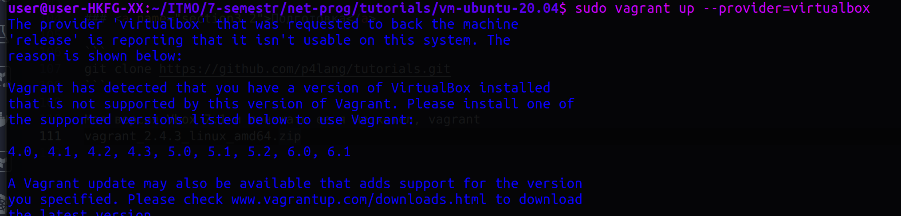</p>

Поэтому устанавливаем вручную бинарник ```vagrant_2.4.3_linux_amd64.zip```, далее ```unzip vagrant_2.4.3_linux_amd64.zip``` и ```sudo mv vagrant /usr/bin/```

Также принудительно меняем вывод версии для инструмента VBoxManage в /usr/bin/VBox

```
    VirtualBoxVM|virtualboxvm)
        exec "$INSTALL_DIR/VirtualBoxVM" "$@"
        ;;
    VBoxManage|vboxmanage)
    ########################
        if [[ $@ == "--version" ]]; then
           echo "7.0.0r164728"
        else
           exec "$INSTALL_DIR/VBoxManage" "$@"
        fi
        ;;
    ########################
    VBoxSDL|vboxsdl)
        exec "$INSTALL_DIR/VBoxSDL" "$@"
        ;;
```

Не очень классно, но вм создается

<p align="center">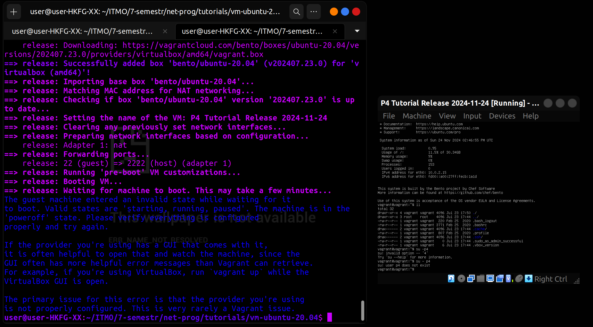</p>

Как видно на скриншоте вм создается как будто не полностью и почему то без gui, хотя строчка ```vb.gui = true``` имеется в vagrantfile, я счел это из за того что на моей системе с Linux очень мало места, поэтому сделал тоже самое на windows, но проблема сохранилась.

Не знаю по каким причинам, именно у меня не получилось просто создать ВМ, но решил это путем небольшого редактирования vagrantfile, именно включения поддержки Intel VT-x и AMD-V виртуализации
```
vb.customize ["modifyvm", :id, "--nested-hw-virt", "on"]
vb.customize ["modifyvm", :id, "--ioapic", "on"]
```


<p align="center">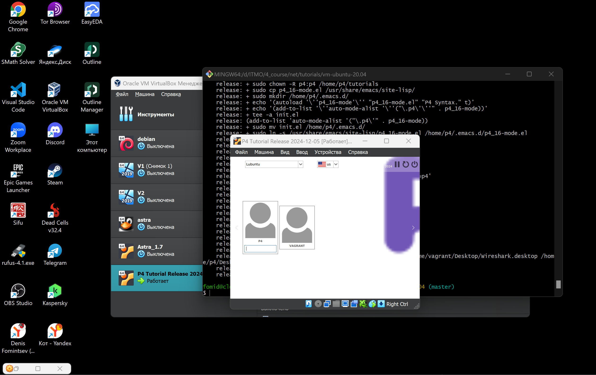</p>

### <a name="section3.3">Implementing Basic Forwarding</a>

Цель этого упражнения — написать программу P4, реализующую базовую пересылку.

При пересылке IPv4 коммутатор должен выполнять следующие действия для каждого пакета: (1) обновлять MAC-адреса источника и назначения, (2) уменьшать время жизни (TTL) в заголовке IP и (3) пересылать пакет через соответствующий порт.

Ваш коммутатор будет иметь одну таблицу, которую плоскость управления будет заполнять статическими правилами. Каждое правило будет сопоставлять IP-адрес с MAC-адресом и выходным портом для следующего перехода. 

Для этого упражнения мы будем использовать следующую топологию.

<p align="center">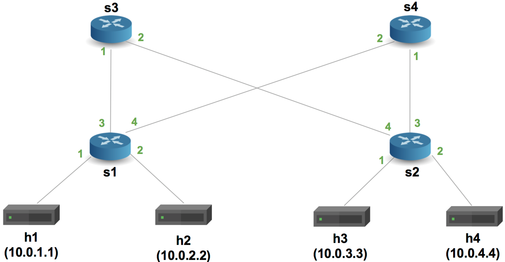</p>


В директрии tutorials/exercices/basic с помощью команды ```make run``` подняли виртуальную сеть Mininet, скомпилировав basic.p4

<p align="center">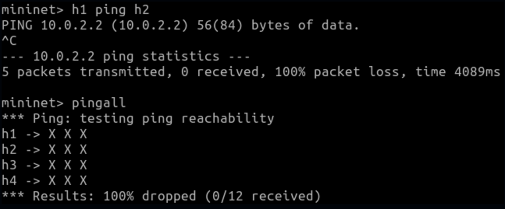</p>

ping не прошел, потому что каждый коммутатор запрограммирован в соответствии с basic.p4, который отбрасывает все пакеты.

Добавим в парсер заголовки ipv4 и ethernet

<p align="center">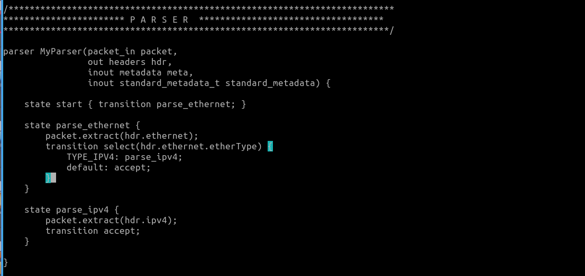</p>

Установим входной порт для пересылки ipv4, обновим исходные mac-адреса и адреса назначения, поменяем значения TTL и добавим таблицы маршрутизации и условия проверки заголовка IPv4.

<p align="center">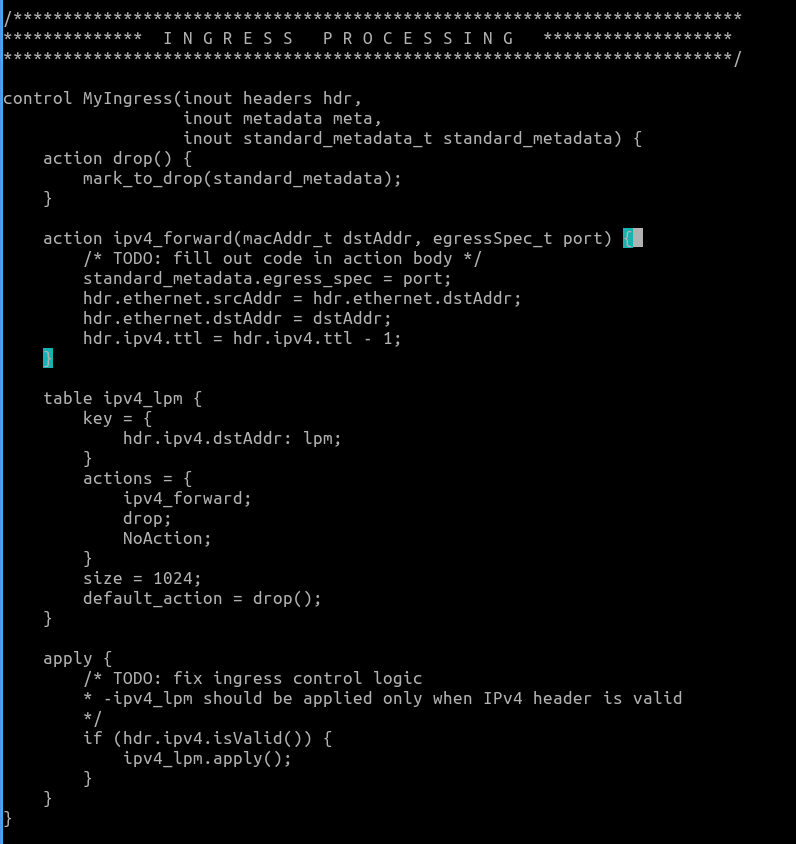</p>

Также напишем депарсер. Он выбирает порядок вставки полей в исходящий пакет.

<p align="center">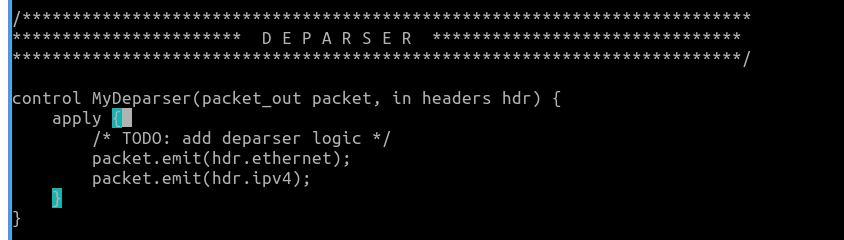</p>

Проверяем

<p align="center">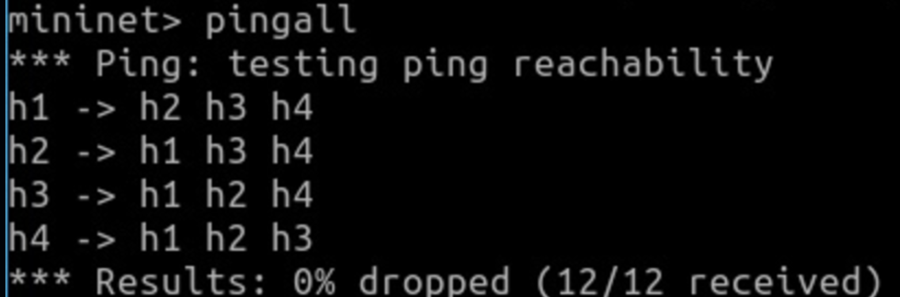</p>


<details>
<summary>Тут полный код basic.p4</summary>

```c
/* -*- P4_16 -*- */
#include <core.p4>
#include <v1model.p4>

const bit<16> TYPE_IPV4 = 0x800;

/*************************************************************************
*********************** H E A D E R S  ***********************************
*************************************************************************/

typedef bit<9>  egressSpec_t;
typedef bit<48> macAddr_t;
typedef bit<32> ip4Addr_t;

header ethernet_t {
    macAddr_t dstAddr;
    macAddr_t srcAddr;
    bit<16>   etherType;
}

header ipv4_t {
    bit<4>    version;
    bit<4>    ihl;
    bit<8>    diffserv;
    bit<16>   totalLen;
    bit<16>   identification;
    bit<3>    flags;
    bit<13>   fragOffset;
    bit<8>    ttl;
    bit<8>    protocol;
    bit<16>   hdrChecksum;
    ip4Addr_t srcAddr;
    ip4Addr_t dstAddr;
}

struct metadata {
    /* empty */
}

struct headers {
    ethernet_t   ethernet;
    ipv4_t       ipv4;
}

/*************************************************************************
*********************** P A R S E R  ***********************************
*************************************************************************/

parser MyParser(packet_in packet,
                out headers hdr,
                inout metadata meta,
                inout standard_metadata_t standard_metadata) {

    state start { transition parse; }

    state parse{
      packet.extract(hdr.ethernet);
      transition select(hdr.ethernet.etherType) {
        TYPE_IPV4: parse_ipv4;
        default: accept;
        }
    }
      
    state parse_ipv4{
      packet.extract(hdr.ipv4);
      transition accept;
    }
}


/*************************************************************************
************   C H E C K S U M    V E R I F I C A T I O N   *************
*************************************************************************/

control MyVerifyChecksum(inout headers hdr, inout metadata meta) {
    apply {  }
}


/*************************************************************************
**************  I N G R E S S   P R O C E S S I N G   *******************
*************************************************************************/

control MyIngress(inout headers hdr,
                  inout metadata meta,
                  inout standard_metadata_t standard_metadata) {
    action drop() {
        mark_to_drop(standard_metadata);
    }

    action ipv4_forward(macAddr_t dstAddr, egressSpec_t port) {
        standard_metadata.egress_spec= port; // Изменяем порт
        hdr.ethernet.srcAddr = hdr.ethernet.dstAddr; // Меняем адрес источника на свой
        hdr.ethernet.dstAddr = dstAddr; // Устанавливаем нового получателя
        hdr.ipv4.ttl = hdr.ipv4.ttl - 1; // Декрементируем TTL
    }

    table ipv4_lpm {
        key = {
            hdr.ipv4.dstAddr: lpm;
        }
        actions = {
            ipv4_forward;
            drop;
            NoAction;
        }
        size = 1024;
        default_action = NoAction();
    }

    apply {
        if (hdr.ipv4.isValid()) {
            ipv4_lpm.apply();
        }
    }
}

/*************************************************************************
****************  E G R E S S   P R O C E S S I N G   *******************
*************************************************************************/

control MyEgress(inout headers hdr,
                 inout metadata meta,
                 inout standard_metadata_t standard_metadata) {
    apply {  }
}

/*************************************************************************
*************   C H E C K S U M    C O M P U T A T I O N   **************
*************************************************************************/

control MyComputeChecksum(inout headers hdr, inout metadata meta) {
     apply {
        update_checksum(
            hdr.ipv4.isValid(),
            { hdr.ipv4.version,
              hdr.ipv4.ihl,
              hdr.ipv4.diffserv,
              hdr.ipv4.totalLen,
              hdr.ipv4.identification,
              hdr.ipv4.flags,
              hdr.ipv4.fragOffset,
              hdr.ipv4.ttl,
              hdr.ipv4.protocol,
              hdr.ipv4.srcAddr,
              hdr.ipv4.dstAddr },
            hdr.ipv4.hdrChecksum,
            HashAlgorithm.csum16);
    }
}


/*************************************************************************
***********************  D E P A R S E R  *******************************
*************************************************************************/

control MyDeparser(packet_out packet, in headers hdr) {
    apply {
        packet.emit(hdr.ethernet);
        packet.emit(hdr.ipv4);
    }
}

/*************************************************************************
***********************  S W I T C H  *******************************
*************************************************************************/

V1Switch(
MyParser(),
MyVerifyChecksum(),
MyIngress(),
MyEgress(),
MyComputeChecksum(),
MyDeparser()
) main;
```
</details>

### <a name="section3.4">Implementing Basic Tunneling</a>

Файл basic_tunnel.p4 содержит реализацию базового IP-маршрутизатора. Он также содержит комментарии, помеченные TODO, которые указывают на функциональность, которую вам необходимо реализовать. Полная реализация коммутатора basic_tunnel.p4 будет способна осуществлять пересылку на основе содержимого пользовательского заголовка инкапсуляции, а также выполнять обычную IP-пересылку, если заголовок инкапсуляции в пакете отсутствует.

Ваша задача будет заключаться в выполнении следующих действий:

ПРИМЕЧАНИЕ: Был добавлен новый тип заголовка myTunnel_t, который содержит два 16-битных поля: proto_id и dst_id.
ПРИМЕЧАНИЕ: Заголовок myTunnel_t был добавлен в структуру headers.
TODO: Обновите парсер для извлечения заголовка myTunnel или заголовка ipv4 на основе поля etherType в заголовке Ethernet. etherType, соответствующий заголовку myTunnel, равен 0x1212. Парсер также должен извлечь заголовок ipv4 после заголовка myTunnel, если proto_id == TYPE_IPV4 (т.е. 0x0800).
TODO: Определите новое действие под названием myTunnel_forward, которое просто устанавливает порт выхода (т.е. поле egress_spec шины standard_metadata) на номер порта, предоставленный плоскостью управления.
TODO: Определите новую таблицу myTunnel_exact, которая выполняет точное соответствие по полю dst_id заголовка myTunnel. Эта таблица должна вызывать действие myTunnel_forward, если в таблице есть совпадение, и должна вызывать действие drop в противном случае.
TODO: Обновите оператор apply в блоке управления MyIngress, чтобы применить вашу новую определенную таблицу myTunnel_exact, если 
TODO: Обновите депарсер, чтобы он выдавал заголовки ethernet, затем myTunnel, затем ipv4. Помните, что депарсер будет выдавать заголовок, только если он валиден. Неявный бит валидности заголовка устанавливается парсером при извлечении. Поэтому проверять валидность заголовка здесь не нужно.
TODO: Добавьте статические правила для вашей новой таблицы, чтобы коммутаторы правильно пересылали для каждого возможного значения dst_id. На схеме ниже показана конфигурация портов топологии, а также то, как мы будем присваивать ID хостам. Для этого шага вам нужно будет добавить правила пересылки в файлы sX-runtime.json.


Вид схемы:

<p align="center">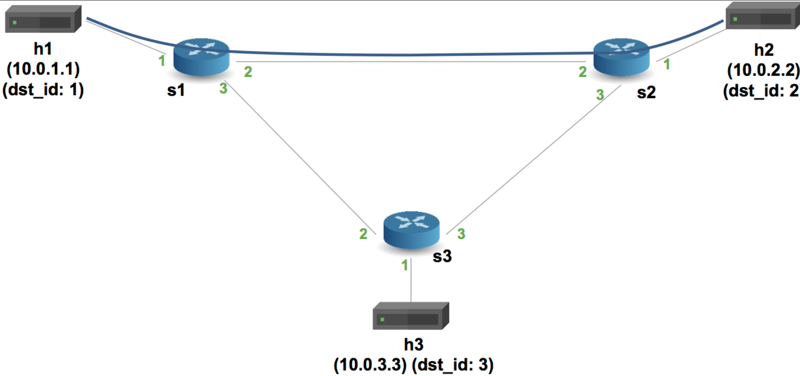</p>


Работа в файле exercises/basic_tunnel/basic_tunnel.p4

Парсер, чтобы он извлекал либо myTunnel заголовок, либо ipv4 заголовок на основе etherType поля в заголовке Ethernet и депарсер

<p align="center">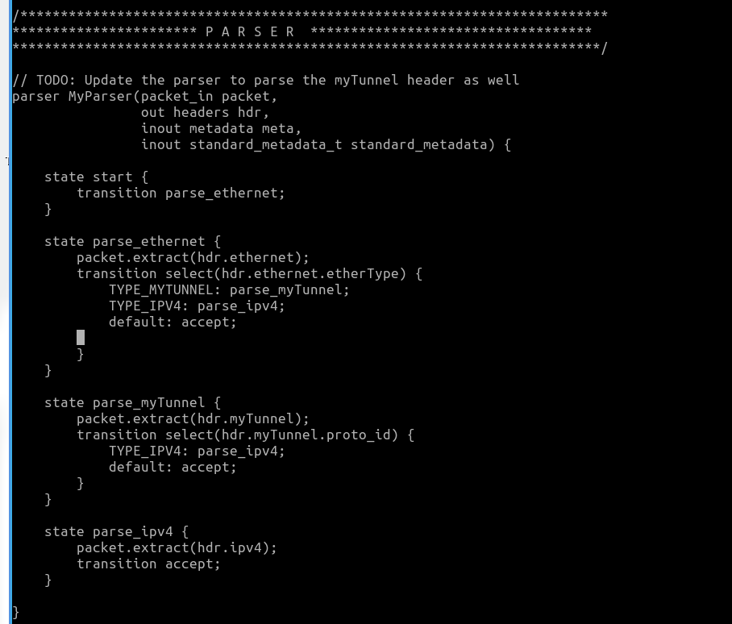</p>

<p align="center">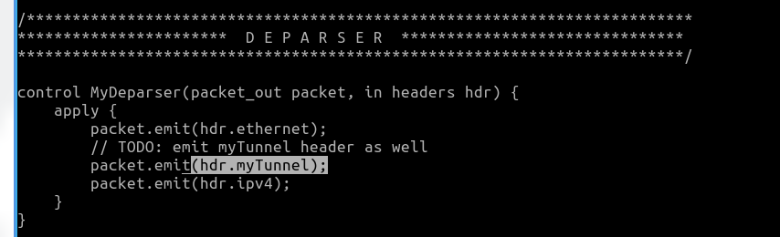</p>

Создадим действие с именем myTunnel_forward, которое будет устанавливать порт выхода и добавим таблицу, аналогичную ipv4_lpm, но в данном случае переадресация заменена на туннельную. Блок apply в управлении MyIngress обновим, чтобы применить новую таблицу myTunnel_exact

<p align="center">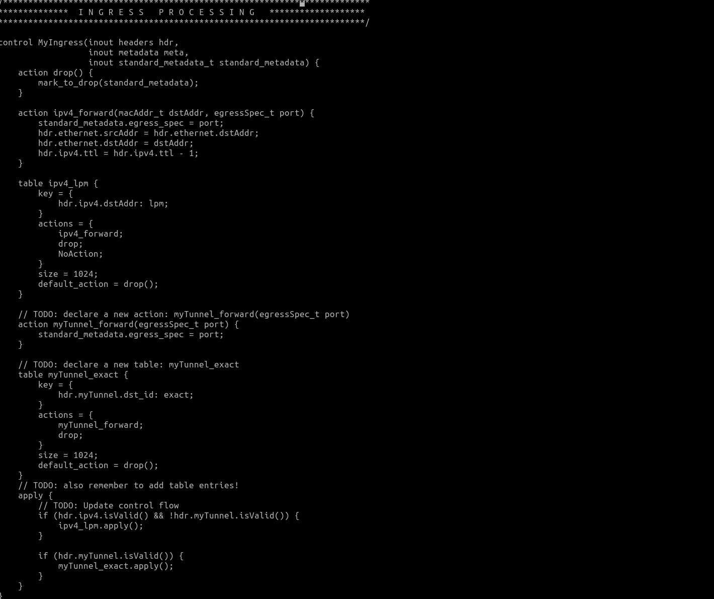</p>

Теперь запустим mininet и проверим связность ```mininet> xterm h1 h2```

Тестирование передачи без туннелирования:

В терминале h1 запустим сервер ```./receive.py``` и с другого узла отправим сообщение: ```./send.py 10.0.2.2 "P4 is cool"```

<p align="center">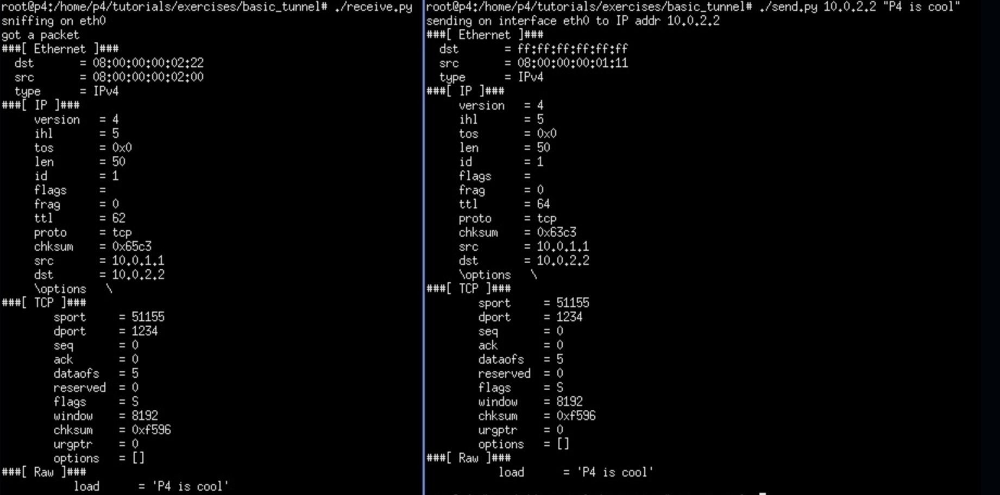</p>

Увидим следующие компоненты:

* Ethernet-заголовок
* IP-заголовок
* TCP-заголовок
* Сообщение
Если изменить IP-адрес назначения (например, попробовать отправить на 10.0.3.3), то сообщение не будет доставлено на h2, а вместо этого будет получено h3.

Теперь тестирование с туннелированием:
В терминале h1 выполним ```./send.py 10.0.2.2 "P4 is cool" --dst_id 2```

<p align="center">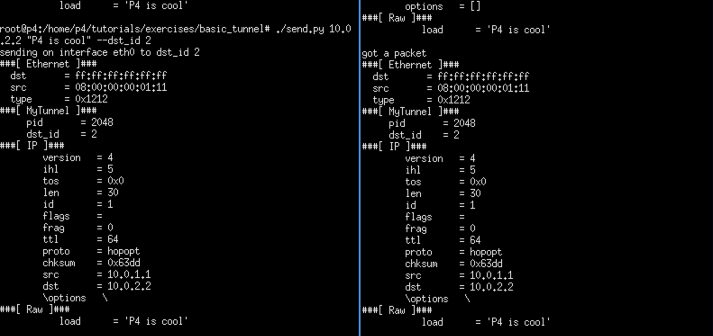</p>

Сообщение будет доставлено на h2. При анализе пакета вы увидим:

* Ethernet-заголовок
* Заголовок туннеля
* IP-заголовок
* TCP-заголовок
* Сообщение

Теперь изменим IP-адрес назначения при отправке сообщения с узла h1, но оставим id h2 ```./send.py 10.0.3.3 "P4 is cool" --dst_id 2```

<p align="center"></p>


<details>
<summary> Тут полный код basic_tunnel.p4</summary>

```c
/* -*- P4_16 -*- */
#include <core.p4>
#include <v1model.p4>

// NOTE: new type added here
const bit<16> TYPE_MYTUNNEL = 0x1212;
const bit<16> TYPE_IPV4 = 0x800;

/*************************************************************************
*********************** H E A D E R S  ***********************************
*************************************************************************/

typedef bit<9>  egressSpec_t;
typedef bit<48> macAddr_t;
typedef bit<32> ip4Addr_t;

header ethernet_t {
    macAddr_t dstAddr;
    macAddr_t srcAddr;
    bit<16>   etherType;
}

// NOTE: added new header type
header myTunnel_t {
    bit<16> proto_id;
    bit<16> dst_id;
}

header ipv4_t {
    bit<4>    version;
    bit<4>    ihl;
    bit<8>    diffserv;
    bit<16>   totalLen;
    bit<16>   identification;
    bit<3>    flags;
    bit<13>   fragOffset;
    bit<8>    ttl;
    bit<8>    protocol;
    bit<16>   hdrChecksum;
    ip4Addr_t srcAddr;
    ip4Addr_t dstAddr;
}

struct metadata {
    /* empty */
}

// NOTE: Added new header type to headers struct
struct headers {
    ethernet_t   ethernet;
    myTunnel_t   myTunnel;
    ipv4_t       ipv4;
}

/*************************************************************************
*********************** P A R S E R  ***********************************
*************************************************************************/

// TODO: Update the parser to parse the myTunnel header as well
parser MyParser(packet_in packet,
                out headers hdr,
                inout metadata meta,
                inout standard_metadata_t standard_metadata) {

    state start {
        transition parse_ethernet;
    }

    state parse_ethernet {
        packet.extract(hdr.ethernet);
        transition select(hdr.ethernet.etherType) {
            TYPE_MYTUNNEL: parse_myTunnel;
            TYPE_IPV4: parse_ipv4;
            default: accept;
        }
    }

    state parse_myTunnel {
        packet.extract(hdr.myTunnel);
        transition select(hdr.myTunnel.proto_id) {
            TYPE_IPV4: parse_ipv4;
            default: accept;
        }
    }

    state parse_ipv4 {
        packet.extract(hdr.ipv4);
        transition accept;
    }

}

/*************************************************************************
************   C H E C K S U M    V E R I F I C A T I O N   *************
*************************************************************************/

control MyVerifyChecksum(inout headers hdr, inout metadata meta) {
    apply {  }
}


/*************************************************************************
**************  I N G R E S S   P R O C E S S I N G   *******************
*************************************************************************/

control MyIngress(inout headers hdr,
                  inout metadata meta,
                  inout standard_metadata_t standard_metadata) {
    action drop() {
        mark_to_drop(standard_metadata);
    }

    action ipv4_forward(macAddr_t dstAddr, egressSpec_t port) {
        standard_metadata.egress_spec = port;
        hdr.ethernet.srcAddr = hdr.ethernet.dstAddr;
        hdr.ethernet.dstAddr = dstAddr;
        hdr.ipv4.ttl = hdr.ipv4.ttl - 1;
    }

    table ipv4_lpm {
        key = {
            hdr.ipv4.dstAddr: lpm;
        }
        actions = {
            ipv4_forward;
            drop;
            NoAction;
        }
        size = 1024;
        default_action = drop();
    }

    // TODO: declare a new action: myTunnel_forward(egressSpec_t port)
    action myTunnel_forward(egressSpec_t port) {
        standard_metadata.egress_spec = port;
    }

    // TODO: declare a new table: myTunnel_exact
    table myTunnel_exact {
        key = {
            hdr.myTunnel.dst_id: exact;
        }
        actions = {
            myTunnel_forward;
            drop;
        }
        size = 1024;
        default_action = drop();
    }
    // TODO: also remember to add table entries!
    apply {
        // TODO: Update control flow
        if (hdr.ipv4.isValid() && !hdr.myTunnel.isValid()) {
            ipv4_lpm.apply();
        }

        if (hdr.myTunnel.isValid()) {
            myTunnel_exact.apply();
        }
    }
}

/*************************************************************************
****************  E G R E S S   P R O C E S S I N G   *******************
*************************************************************************/

control MyEgress(inout headers hdr,
                 inout metadata meta,
                 inout standard_metadata_t standard_metadata) {
    apply {  }
}

/*************************************************************************
*************   C H E C K S U M    C O M P U T A T I O N   **************
*************************************************************************/

control MyComputeChecksum(inout headers  hdr, inout metadata meta) {
     apply {
        update_checksum(
            hdr.ipv4.isValid(),
            { hdr.ipv4.version,
              hdr.ipv4.ihl,
              hdr.ipv4.diffserv,
              hdr.ipv4.totalLen,
              hdr.ipv4.identification,
              hdr.ipv4.flags,
              hdr.ipv4.fragOffset,
              hdr.ipv4.ttl,
              hdr.ipv4.protocol,
              hdr.ipv4.srcAddr,
              hdr.ipv4.dstAddr },
            hdr.ipv4.hdrChecksum,
            HashAlgorithm.csum16);
    }
}

/*************************************************************************
***********************  D E P A R S E R  *******************************
*************************************************************************/

control MyDeparser(packet_out packet, in headers hdr) {
    apply {
        packet.emit(hdr.ethernet);
        // TODO: emit myTunnel header as well
        packet.emit(hdr.myTunnel); // Заголовок туннеля
        packet.emit(hdr.ipv4);
    }
}

/*************************************************************************
***********************  S W I T C H  *******************************
*************************************************************************/

V1Switch(
MyParser(),
MyVerifyChecksum(),
MyIngress(),
MyEgress(),
MyComputeChecksum(),
MyDeparser()
) main;
```
</details>

### <a name="section3.2">Вывод</a>

В ходе выполнения данной лабораторной работы, познакомились со специализированным языком программирования для работы с сетевым трафиком на уровне чипа - P4 (Programming Protocol-Independent Packet Processors) и выполнили 2 задания с официального git репозитория (Implementing Basic Forwarding и Implementing Basic Tunneling)

